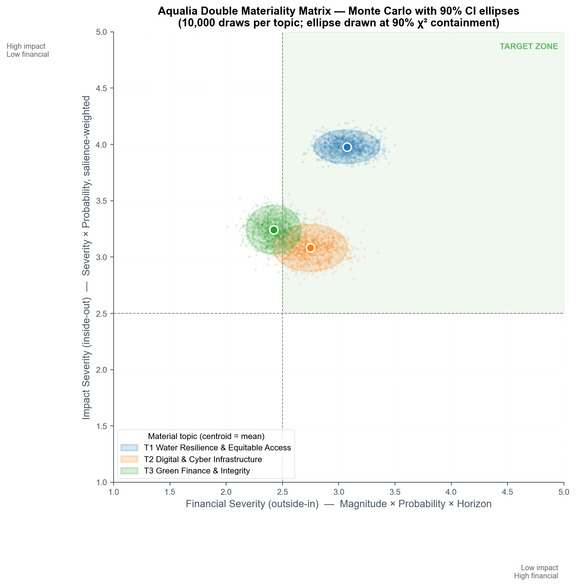

<!--
Aqualia Datathon — 5-minute pitch. Target 4:50–5:00.
Every slide has presenter notes below the content.
To export to PowerPoint or PDF:
    npm install -g @marp-team/marp-cli
    marp deck.marp.md --pptx      -> deck.marp.pptx
    marp deck.marp.md --pdf       -> deck.marp.pdf
    marp deck.marp.md --html      -> deck.marp.html
-->

<!-- _class: lead -->
<!-- _paginate: false -->
<!-- _backgroundColor: "#002f5f" -->
<!-- _color: "#ffffff" -->

# Water as Strategy

### A Double Materiality Framework for Aqualia, 2027–2030

IE Sustainability Datathon · March 2026 · Team [name]

<!--
SPEAKER NOTES (0:00 → 0:15)
"Good [morning/afternoon]. We're presenting a double materiality review
for Aqualia — and a specific, €500 million ask to turn it into strategy."
Advance immediately. Do not linger.
-->

---

## Three topics. One number. One ask.

T1
<h3 style="margin:6px 0 4px 0">Water Resilience & Equitable Access</h3>

Secure and equitable delivery of the urban water cycle under climate stress, across concessions.

T2
<h3 style="margin:6px 0 4px 0">Digital & Cyber Infrastructure</h3>

Digital-twin-enabled operational resilience, with cybersecurity as a first-order financial risk.

T3
<h3 style="margin:6px 0 4px 0">Green Finance & Integrity</h3>

EU-Taxonomy-aligned financing of the 2027–2030 CAPEX pipeline, underpinned by compliance depth.

Together: €18 M/yr of net financial materiality Aqualia's current framework under-weights — and €440 M of 2027–2030 CAPEX already implied by their own Risk Map.

<strong style="color:white">Our ask:</strong> a €500 M EU-Taxonomy-aligned green bond programme

<!--
SPEAKER NOTES (0:15 → 1:00, 45 sec)
"Aqualia is a €1.4 billion integrated water utility under CSRD. Our review
landed on three topics. Water Resilience and Equitable Access. Digital and
Cyber Infrastructure. Green Finance and Integrity. Together they represent
€18 million per year of net financial materiality Aqualia's current
framework under-weights — and €440 million of 2027–2030 CAPEX that's
already implied by their own risk map. Our ask is one action: a €500 million
EU-Taxonomy-aligned green bond programme that funds the CAPEX and closes
the materiality gap."

Timing check: you should reach the word "programme" at 1:00.
Judges should remember: 3 topics, €18M/yr, €500M bond. That's it.
-->

---

## Not a point. A distribution.

<!-- Insert 04_matrix/matrix_mc.png here -->

**10,000 draws per topic.**
90% χ² confidence ellipses.

- T1 solid in Target Zone
- T2 blind-spot repositioning confirmed
- T3 knife-edge — conditionally material

Ranking stable across **4 stakeholder-weighting schemes.**

<!--
SPEAKER NOTES (1:00 → 1:50, 50 sec)
"Here's what differentiates our methodology. Instead of plotting each topic
as a single point, we ran a ten-thousand-draw Monte Carlo over every input
— scale, scope, remediability, probability, financial magnitude, and
stakeholder salience. Each topic shows up as a ninety-percent confidence
ellipse. T1 water resilience lands solidly in the Target Zone. T2 — digital
and cyber — confirms our hero finding, the blind spot. T3 sits on the
knife-edge, which isn't a weakness, it's urgency: any tightening of CSRD
enforcement or cost-of-capital spread pushes it in. And under every
stakeholder-weighting scheme we tested, the ranking stayed the same."

Hand-off: "The blind spot is the most interesting story on this slide,
so let me zoom in."
-->

---

## Two IROs. Three HIGH risks. One blind spot.

**Aqualia 2025 review assigns Digitalisation: 2 IROs.** The lowest of any topic.

**Meanwhile:**
- Veolia Suez Global Omnium — digital platforms as core strategic pillar
- EU Water Resilience Strategy — Digitalisation is Action Area 3 of 5
- WEF Global Risks 2025–2026 — cyber insecurity in top-10
- Aqualia's own risk map: O8, O9, O10 all HIGH

**A topic scored as 2 IROs is producing three HIGH operational risks.**

Our Monte Carlo re-prices T2 into the Target Zone.

AQ-DIG-1

RED

AQ-CYB-1

RED

AQ-CYB-2

DARK RED

ESRS gap heatmap (873 chunks, 2022–2025 reports)

<!--
SPEAKER NOTES (1:50 → 2:45, 55 sec)
"In Aqualia's 2025 double materiality review, Digitalisation was assigned
exactly two impacts, risks, and opportunities — the lowest of any topic.
Meanwhile, Veolia, Suez, and Global Omnium each treat digital platforms as
their core ESG pillar. The EU Water Resilience Strategy names digitalisation
one of five Action Areas. The World Economic Forum ranks cyber insecurity
in the top ten long-term risks. And here's the clincher — Aqualia's OWN
risk map catalogues three HIGH operational risks in this cluster: deficient
digital deployment, deficient cyber response, and customer-data management.
A topic they scored as two IROs is producing three of their highest risks.
That's the blind spot. Our Monte Carlo re-prices it into the Target Zone."

Hand-off: "Once you fix the framing, the financial case follows."
-->

---

## The capital markets opportunity

Vanilla IG coupon

4.00%

−

ESG-aligned spread

25 bp

=

PV interest savings (10y @ 8%)

€31 M

T1 Water resilience CAPEX

€340 M

T2 Digital & cyber CAPEX

€80 M

T3 Compliance CAPEX

€18 M

Tranche schedule: <strong>2027 €150 M</strong> · <strong>2028 €150 M</strong> · <strong>2029 €120 M</strong> · <strong>2030 €80 M</strong> · Total €500 M

<!--
SPEAKER NOTES (2:45 → 3:45, 60 sec)
"Here's how our three topics become capital. The 2027-2030 CAPEX pipeline
implied by Aqualia's own risk map totals four hundred and forty million
euros — water infrastructure, digital resilience, and compliance systems.
We propose funding it with a five hundred million euro EU-Taxonomy-aligned
green bond programme, tranched across four years. Because Aqualia already
promotes green finance to stand-alone material status — ahead of peers —
the documentation story is tractable. At the twenty-five basis point
coupon spread this class of issuance is currently attracting in European
investment-grade water, that saves Aqualia thirty-one million euros in
present-value interest over the bond's life. The topic on the knife-edge
becomes the action."

Key verbal numbers: €440 M CAPEX · €500 M bond · 25 bp spread · €31 M PV
savings · 10-year tenor.
-->

---

## 2027 to 2030 — owned, measurable, aligned

<table style="width:100%;font-size:0.78em;border-collapse:collapse">
<thead>
<tr style="background:var(--sand);color:var(--navy)">
<th style="padding:8px;text-align:left;width:12%"></th>
<th style="padding:8px">2027</th>
<th style="padding:8px">2028</th>
<th style="padding:8px">2029</th>
<th style="padding:8px">2030</th>
</tr>
</thead>
<tbody>
<tr style="border-bottom:1px solid var(--grid)">
<td style="padding:10px;background:var(--t1);color:white;font-weight:700">T1</td>
<td style="padding:8px">S3 restored + <b>Colombia review</b> Ops Director</td>
<td style="padding:8px">Segura reuse pilot NRW −3 pp</td>
<td style="padding:8px">Italy adaptation CAPEX −10% tCO₂e/m³</td>
<td style="padding:8px">Reuse ≥ 25% RD 1985/2024</td>
</tr>
<tr style="border-bottom:1px solid var(--grid)">
<td style="padding:10px;background:var(--t2);color:white;font-weight:700">T2</td>
<td style="padding:8px">Digital-twin Phase 1 3 concessions</td>
<td style="padding:8px">OT/IT segmentation NIS2 readiness ≥ 90%</td>
<td style="padding:8px">AI demand prediction leak MTTR −30%</td>
<td style="padding:8px">Cyber MTTR &lt; 4h ~1% rev cyber spend</td>
</tr>
<tr>
<td style="padding:10px;background:var(--t3);color:white;font-weight:700">T3</td>
<td style="padding:8px"><b>Tranche 1 €150 M</b> EU Taxonomy</td>
<td style="padding:8px">Tranche 2 €150 M CSRD full + assurance</td>
<td style="padding:8px">Tranche 3 €120 M ISO 14001:2026</td>
<td style="padding:8px">Tranche 4 €80 M TCFD + TNFD full</td>
</tr>
</tbody>
</table>

Every cell has a named Executive Committee owner from Aqualia's Risk Map, a measurable KPI, and an ESRS disclosure anchor. Full roadmap in report §8.

<!--
SPEAKER NOTES (3:45 → 4:35, 50 sec)
"Every recommendation has an owner on Aqualia's executive committee, a
measurable KPI, and a 2027-2030 date. On T1, it starts in 2027 with ESRS
S3 restoration and a concession review for Colombia — the thirty-three-
percent satisfaction market — then rolls into reuse-market CAPEX aligned
to Royal Decree 1985/2024. On T2, a digital-twin rollout phased across
concessions with NIS2 readiness by 2028. On T3, four green-bond tranches
phased with the CAPEX drawdown, full CSRD report in 2028, and ISO
14001:2026 alignment in 2029."

Transition cue: the word "alignment" lands ~4:35.
-->

---

<!-- _class: lead -->
<!-- _paginate: false -->
<!-- _backgroundColor: "#002f5f" -->
<!-- _color: "#ffffff" -->

<strong style="color:var(--aqua)">Three material topics.</strong> 
<strong style="color:var(--aqua)">€18 M/yr</strong> of under-weighted materiality. 
A <strong style="color:var(--aqua)">€500 M</strong> green bond programme that funds the answer.

Thank you. Questions welcome.

<!-- Replace with actual QR when the React dashboard is deployed -->

[QR] Interactive matrix + ESRS gap heatmap

<!--
SPEAKER NOTES (4:35 → 5:00, 25 sec)
Slide 7 is CARDINAL — recite verbatim:
"Three material topics. Eighteen million euros a year of under-weighted
financial materiality. A five-hundred-million-euro green bond programme
that funds the answer. For detail, the QR code links our interactive
matrix and ESRS coverage heatmap. Thank you."

Stop. Do not add anything. Judges will ask questions.
Timing: "Thank you" should land 4:55–5:00.
-->
